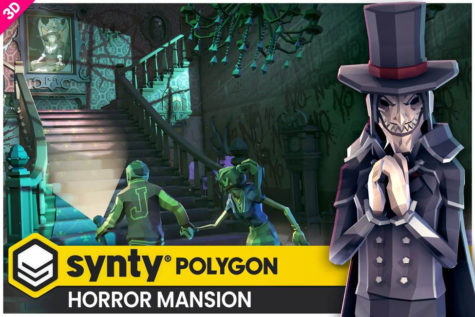
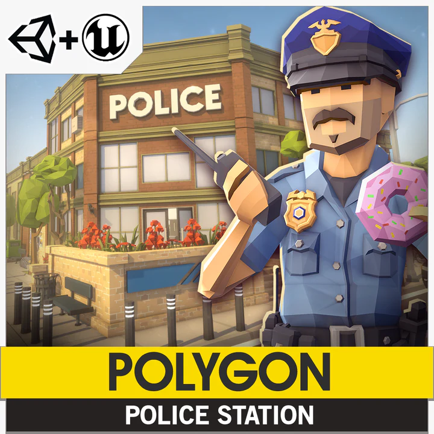

# AUBRY Mathias - MELIANI Samy - Projet Unity3D - E4FI - Head In The Cloud

Auteur: Mathias AUBRY
Co-auteur: samy meliani

# 🌌 Head In The Cloud

**Projet Unity3D — Réalité Virtuelle**

*AUBRY Mathias · MELIANI Samy | E4FI | 2025–2026 | ESIEE Paris*

[https://github.com/Mathatou/HeadInTheCloud](https://github.com/Mathatou/HeadInTheCloud)

---

## 📌 Description du projet

Head In The Cloud est un jeu en Réalité Virtuelle réalisé dans le cadre de l’unité **Projet Multidisciplinaire 4** à ESIEE Paris en E4FI. Il s’agit d’une expérience d’exploration, de tir et de réflexion. Le joueur commence dans un **lobby central** (forêt avec feu de camp) et traverse des portails pour accéder à trois expériences distinctes : un mini-jeu de tir dans un univers Far West, un labyrinthe d’horreur, et un escape-game de réflexion.

## 🛠 Technologies utilisées

- **Moteur de jeu :** Unity
- **Langage de programmation :** C#
- **Logiciels tiers** : Github, GIMP, Blender, Audacity
- **Casque VR :** Meta Quest 2

## 🎨 Assets

[Polygon Horror Mansion (Synty)](https://assetstore.unity.com/packages/3d/environments/fantasy/polygon-horror-mansion-low-poly-3d-art-by-synty-213346)

[Polygon Police Station (Synty)](https://syntystore.com/products/polygon-police-station)

[**Low Poly Winter Log Cabin Pack**](https://assetstore.unity.com/packages/3d/environments/low-poly-winter-log-cabin-pack-347838)

[Bold Pixel Font](https://assetstore.unity.com/packages/2d/fonts/boldpixels-font-332078)

## 🎮 Comment jouer ?

1. Télécharger sur Github la release du jeu 
2. Récupérer l’APK
3. Transférer l’APK sur le casque

## 👥 Équipe

- AUBRY Mathias - Développeur / Game dev
- MELIANI Samy  - Développeur / Game dev

## 📜 Licence & Crédits

- Ce projet est réalisé dans un cadre éducatif et n’est pas destiné à une diffusion commerciale.
- Les assets utilisés appartiennent à leurs créateurs respectifs et sont utilisés sous licence appropriée.
- Nous remercions également APPUDURAI Achveiya, étudiante à ESIEE Paris en E3E pour nous avoir prêté sa voix pour les dialogues du PNJ.

---

# ⌨️ Rapport Technique :

## 1. Critères d’évaluation technique (Unity3D)

### a. Développement et préparation des scènes

**📋 Critère : Précision et pertinence des modèles 3D intégrés dans l’environnement VR**

Tous les environnements adoptent une direction artistique **Low-Poly** cohérente, sélectionnée pour répondre aux contraintes matérielles du Meta Quest 2. Les assets proviennent de packs de l’Asset Store Unity :

- **Far West** : packs PolyOne, PolyRonin et SkullsInSombreros2 (saloon et terrain).
- **Labyrinthe** : pack POLYGON – HorrorMansion (Synty) pour le décor et les monstres.
- **Escape Game** : pack Low Poly Winter Log Cabin Pack pour la cabane isolée.
- **Lobby** : assets Blender personnalisés (portails, feu de camp) et briquet retravaillé (correction de mesh).

---

**📋 Critère : Méthodologie pour l’intégration des éléments 3D dans un contexte de réalité virtuelle**

Les scènes ont été pensées à **taille humaine** pour maximiser le sentiment de présence du joueur. Certains assets tiers ont été nettoyés et optimisés via Blender avant intégration (correction de mesh). Certaines textures ont été créées ou retouchées avec GIMP. Le versioning GitHub a permis un travail en parallèle sur les différentes scènes sans conflits.

---

### b. Interactivité et réactivité

**📋 Critère : Conception et implémentation d’interactions utilisateur significatives et intuitives**

Un système d’interaction physique complet a été développé, à l’aide du XRI, permettant la manipulation d’objets variés :

- **Lobby** : interaction avec le briquet pour allumer le feu de camp (déclencheur visuel); traversée des portails pour activer un niveau.
- **Far West** : prise en main des deux pistolets de couleurs, tir sur cibles via Raycasting, lecture du scoreboard dynamique et persistance des données.
- **Labyrinthe** : collecte des 4 orbes fantomatiques déclenchant l’apparition de la clé et l’ouverture de la grille (feedback de progression sans menu UI).
- **Escape Game** : manipulation de tiroirs, manivelles et échelles pour résoudre les énigmes ; Randomization d’énigmes rendant chaque participation différentes

---

**📋 Critère : Utilisation de capteurs et d’entrées pour enrichir l’expérience utilisateur**

Le projet exploite les contrôleurs du Meta Quest 2 (joysticks et boutons) pour deux modes de déplacement : **mouvement continu** (joystick gauche) et **téléportation** sur distance choisie (joystick droit). Cette dualité permet à chaque joueur d’adapter son expérience selon sa sensibilité au motion sickness. La capacité de saut a été retirée pour éviter le motion sickness

---

### c. Optimisation et performance

**📋 Critère : Techniques de réduction de la latence et optimisation pour des performances fluides en VR**

L’optimisation a été un axe central du développement, le Meta Quest 2 disposant de ressources limitées :

- Brouillard du labyrinthe implémenté via le **système de particules** au sol (plutôt qu’une brume globale) pour préserver le framerate.
- Réduction de la taille des terrains et du nombre d’assets par scène.
- **Shaders personnalisés** via ShaderGraph optimisés pour une exécution efficace sur le processeur embarqué du casque.

---

### d. Rendu et visualisation

**📋 Critère : Qualité du rendu visuel en tenant compte des contraintes de l’affichage en réalité virtuelle**

Plusieurs techniques de rendu avancées ont été mises en œuvre via ShaderGraph :

- **Portails** : shader personnalisé donnant un aspect visuel unique signalant la téléportation inter-niveaux. Chaque portails ont une couleur différente indiquant leur unicité
- **Feu de camp** : shader simulant l’allumage et les flammes de manière optimisée.
- **Déplacement d’objet (Far West)** : shader d’oscillation sur un triangle Blender pour guider le regard du joueur.
- **Decals :** Shader de Decals personnalisés permettant de joueur sur l’alpha de la projection
- **Effets VFX** : Muzzle Flash et Explosion à l’impact des cibles, brouillard au sol dans le labyrinthe.

---

## 2. Critères d’évaluation artistique

### a. Conception et esthétique

**📋 Critère : Cohérence esthétique des scènes VR et leur contribution à la narration visuelle**

L’ensemble du projet adopte une direction **Low-Poly** cohérente sur les quatre scènes et les mêmes conventions visuelles (portails). Chaque univers possède néanmoins une identité sonore et visuelle propre :

- Ambiance désertique et musique de bar pour le **Far West**
- Atmosphère lourde et brouillard dense pour le **labyrinthe**
- Silence naturel et son de portails pour le **lobby**

---

**📋 Critère : Originalité et créativité dans la conception des éléments visuels et interactifs**

Le concept du **lobby-portails** (inspiré de VRChat) comme méta-structure reliant plusieurs genres de gameplay distincts est une approche originale. Les sources d’inspiration sont clairement identifiées et détournées :

- Beat Saber → Color Shooter
- Where The Darkness Took Them → labyrinthe

L’asset au centre de toutes les expériences, le portail, a été modélisé sur-mesure dans Blender.

---

### b. Immersion et expérimentation

**📋 Critère : Qualité de l’immersion de l’utilisateur dans la scène VR**

Plusieurs leviers d’immersion ont été actionnés :

- Scènes construites à **taille humaine** pour un sentiment de présence physique.
- Interface utilisateur : scoreboard intégré au décor Far West, feedback de progression via l’état du monde (ouverture de grille).
- **Onboarding progressif** dans le lobby : apprentissage des contrôles via le briquet et des explications vocales avant d’entrer dans un niveau.

---

**📋 Critère : Expérimentation avec des effets visuels et sonores pour créer une expérience VR unique et engageante**

Les assets audio comprennent des **enregistrements réels** (musique et bruitages guitare enregistrés par l’équipe) complétés par des sons récupérés sur des sites dédiés. Chaque environnement dispose d’une ambiance sonore unique renforçant son atmosphère. Les effets visuels (VFX) — Muzzle Flash, brouillard de particules — ont été pensés autant pour l’immersion que pour les contraintes de performance du Quest 2.

---

## 3. Critères d’évaluation — Présentation Notion

### a. Clarté et structure

**📋 Critère : Clarté et logique de la présentation du projet VR**

La documentation Notion suit une progression logique :

> Description générale → Stack technique → Assets → Comment installer → Equipe → Licence & Crédits → Rapport Technique → Mise en œuvre Unity3D → Critères artistiques → Gestion de projet → Améliorations futures
> 

---

**📋 Critère : Cohérence entre la documentation écrite et la visualisation des scènes VR**

Voici le lien vers la vidéo :  https://youtu.be/mjYn0mLeB84

Description de la vidéo en point c.

[https://youtu.be/mjYn0mLeB84](https://youtu.be/mjYn0mLeB84)

---

### b. Profondeur de l’explication technique

**📋 Critère : Explication des choix techniques — interactions et optimisation**

- **Meta Quest 2 :** (autonome, sans-fil)
- **GitHub** : versioning et travail en parallèle.
- **Notion** : backlog d’idées et documentation.
- **Raycasting** : choisi pour sa légèreté computationnelle dans la détection de tirs.
- **Shader** : shaders simples écrits à la main et avec le shader graph
- **Blender:** Facilité de prise en main pour les tâches simples comme la création de mesh simple
- **GIMP**: Facilité de prise en main pour la conception de textures

---

**📋 Critère : Justification des techniques utilisées pour l’intégration des éléments virtuels**

Le style **Low-Poly** a été choisi avant tout pour ses performances : moins de polygones → moins de Draw Calls pour le Quest 2. Il permet aussi d'éviter des textures lourdes, ce qui soulage la mémoire du casque.

Le **LOD (Level of Detail)** complète cette logique : Unity simplifie automatiquement les meshes des objets éloignés du joueur, qui ne les regardera de toute façon pas de près. Résultat, le GPU ne rame que sur ce qui est vraiment visible.

---

### c. Présentation des résultats

**📋 Critère : Qualité de la visualisation des résultats, y compris des démonstrations interactives**

La vidéo montre la passage de trois scènes : Le lobby, le far-west et l’escape game, comme dit dans la vidéo, par soucis de temps, le labyrinthe n’est pas montré. Dans le lobby on voit l’interaction avec le briquet et le feu, dans la scène far-west on voit les interactions de tir et le scoreboard dynamique, on voit également l’utilisation de sockets. Pour finir, dans la scène escape game, on voit rapidement la résolution de l’énigme principale, on peut lancer une balle et casser la vitre, on voit comment monter à une échelle, comment tourner la manivelle de la caméra, ainsi permettant de projeter sur le mur des motifs (decals). Puis on voit l’interaction avec le digicode, avec le Near-Far interactor, jouant une mélodie lorsque le bon code est rentré, lançant donc une animation avec une mélodie de réussite tirée des jeux Zelda.

---

**📋 Critère : Comparaison avec des références / études de cas — analyse critique**

| Référence | Mécanique reprise | Notre différenciation |
| --- | --- | --- |
| **VRChat** | Hub avec portails | Portails = modes de jeu distincts, pas des espaces sociaux |
| **Beat Saber** | Synchronicité des couleurs
Persistance des données  | Arme de couleur bleue et rouge, le joueur doit tirer respectivement sur les cibles bleues et rouges
Scoreboard dynamique → compétition |
| **Where The Darkness Took Them** | Mécaniques de labyrinthe | Amplifié par le passage en VR, décuplant l’aspect oppressant |

---

## 4. Vérification des 3 conditions obligatoires

### Condition 1 — CyberSickness (stabilité > 30 secondes)

Deux modes de déplacement ont été implémentés pour prévenir le motion sickness :

- **Mouvement continu** : géré par le joystick gauche, pour les joueurs habitués à la VR.
- **Téléportation** : sur distance choisie via le joystick droit, pour les joueurs sensibles au mal des transports.
- **Feedback Utilisateur :**
    - Les joueurs n’ont pas ressenti de motion sickness dans le jeu
    - Après retour utilisateur, nous avons remarqué que nous avions pas régler tous les soucis de Z-Fighting

---

### Condition 2 — Théorie des I² (au moins 2 spécificités)

**Immersion (I1)**

- Les scènes ont été pensées à taille humaine.
- Les ambiances sonores uniques à chaque environnement (forêt pesante, son naturel de portails) renforcent la présence physique du joueur dans chaque univers.
- Les effets spéciaux renforcent l’immersion, lorsque le joueur tire il y a une fumée et un flash qui se dégage qui, à chaque tirs sont différents. De même, le feu du lobby, est cohérent avec la scène qui l’entoure

**Interactivité (I2)**

- Les objets manipulables déclenchent des scripts d’interaction directe (briquet → feu, pistolets → tir, portails → téléportation, manivelle → projection sur le mur, digicode → ouverture de coffre).

---

### Condition 3 — Créativité et innovation dans les effets spéciaux

- **Portails inter-niveaux** : shader ShaderGraph avec effet de distorsion
- **Feu de camp interactif** : simulation ShaderGraph des flammes déclenchée par l’interaction avec le briquet — premier élément d’apprentissage de la VR.
- **Brouillard de particules au sol** (labyrinthe) : choix artistique et technique amplifiant l’oppression sans surcharger le GPU.
- **Shader d’oscillation** (Far West) : guidage du regard du joueur via un objet animé, sans marqueur UI intrusif.
- **Muzzle Flash & Explosion** : retour visuel immédiat sur l’action de tir, renforçant le sentiment de puissance des pistolets.

---

## 5. Améliorations envisagées (Nice-to-haves)

- Intégration plus poussée des **audios spatialisés** (musique 3D, SFX complexes par zone).
- Intégration plus poussée de la lumière.
- **Événements horrifiques scriptés** avec part d’aléatoire dans le labyrinthe